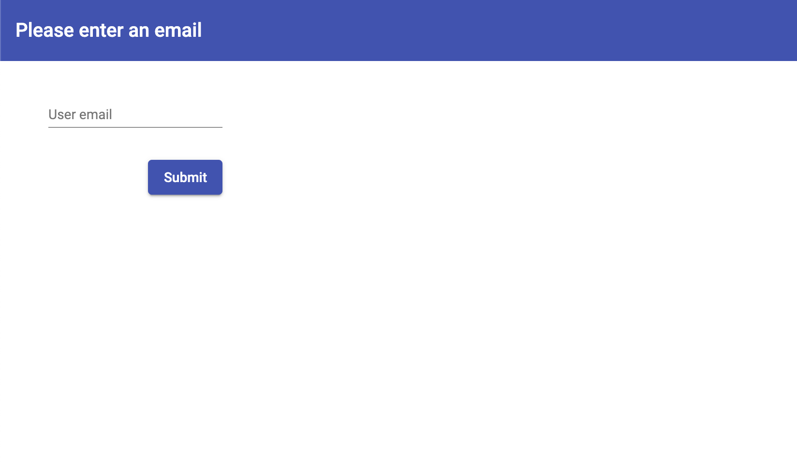
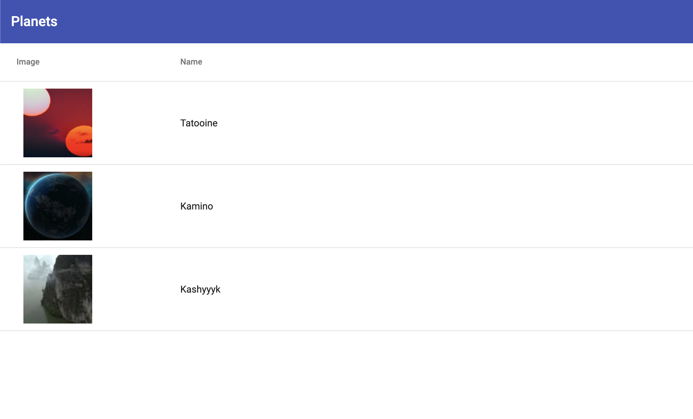
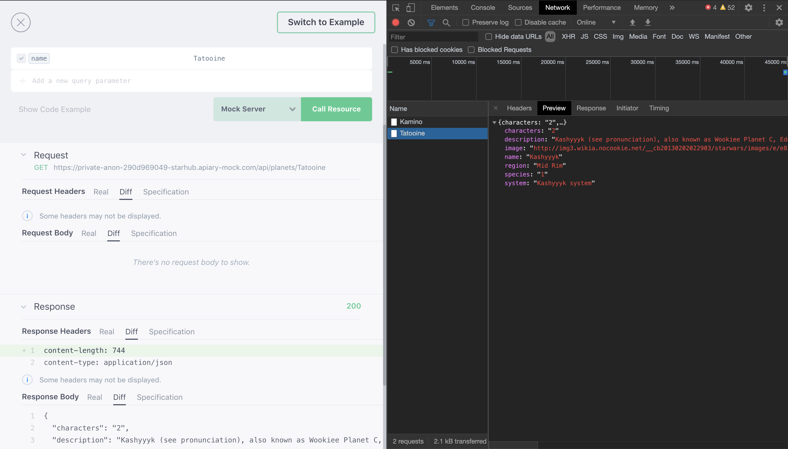
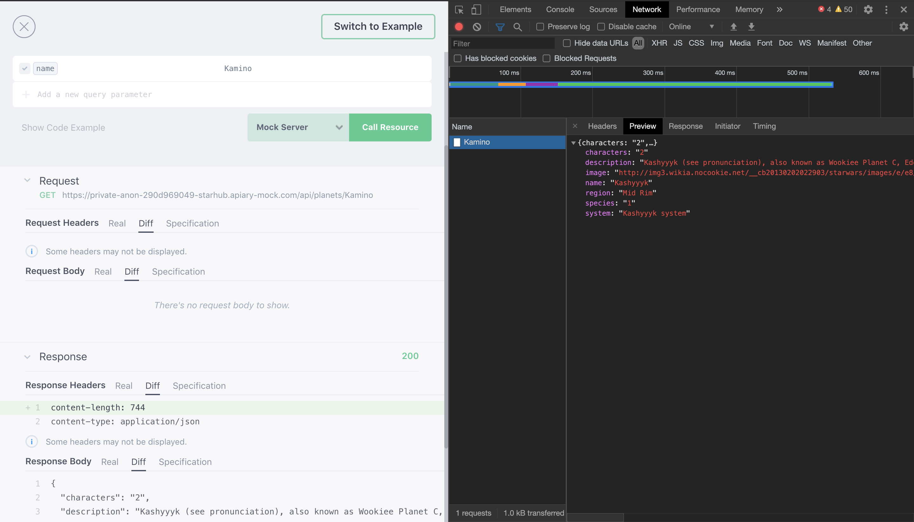

# Planets Test App

This project was implemented using [Angular CLI](https://github.com/angular/angular-cli) version 9.1.12 with [Angular Material](https://material.angular.io/) version 9.2.4.

## Development server

Use `npm i` to install dependencies. Run `ng serve` for a dev server. Navigate to `http://localhost:4200/`. The app will automatically reload if you change any of the source files.

## Build

Run `ng build` to build the project. The build artifacts will be stored in the `dist/` directory. Use the `--prod` flag for a production build.

## Documentation

### Navigation

Build app locally and navigate to `http://localhost:4200/` in your browser.

App starts and redirects to email check page

Use valid form of email and use submit button to proceed

You'll see planets list next

Use any item from list to check individual page with planet info

### Known issues 

Backend API responds with incorect data 

Request examples: 

[Tatooine](https://private-anon-290d969049-starhub.apiary-mock.com/api/planets/Tatooine)

[Kamino](https://private-anon-290d969049-starhub.apiary-mock.com/api/planets/Kamino)

All requests have responses with Kashyyyk data